## About the connector
QRadar SIEM helps your business by detecting anomalies, uncovering advanced threats and removing false positives. It consolidates log events and network flow data from thousands of devices, endpoints, and applications distributed throughout a network.

This document provides information about the QRadar connector, which facilitates automated interactions, with a QRadar server using CyOPs™ playbooks. Add the QRadar connector as a step in CyOPs™ playbooks and perform automated operations, such as automatically getting information about the offenses and details of the offenses from QRadar and also querying a QRadar device.

### Version information
Connector Version: 1.2.0

Compatibility with CyOPs™ Versions: 4.10.3-161 and later

Compatibility with QRadar Versions: 7.2.8 and later

### Release Notes for version 1.2.0

Following enhancements have been made to the QRadar connector in version 1.2.0:

- Added the Get Offenses Type operation. 

## Installing the connector

All connectors provided by  CyOPs™ are delivered using a CyOPs™ repository. Therefore, you must set up your CyOPs™ repository and use the `yum` command to install connectors:

`yum install cyops-connector-qradar`

To update a  CyOPs™-provided connector use the following command:

`yum update cyops-connector-qradar`

To remove a  CyOPs™-provided connector use the following command:

`yum remove cyops-connector-qradar`

The process to write your own custom connector is defined in the `Building a custom connector` topic.

## Prerequisites to configuring the connector

- You must have the IP address of QRadar server to which you will connect and perform the automated operations and API token to access that server. 
- To access the CyOPs™ UI, ensure that port 443 is open through the firewall for the CyOPs™ instance.
- To automatically forward offenses from the QRadar UI to CyOPs™ directly, you must install and configure the CyberSponse Application on the QRadar server. See the [Installing the CyberSponse Application on the QRadar Server](#Installing-CyOPs-app-QRadar-Server) section.

## Configuring the connector

!!! Note  
		This procedure assumes that you are using CyOPs™ version 4.10.3. If you are using a different version of CyOPs™, such as CyOPs™ 4.9, then it is possible that the CyOPs™ UI navigation is different. Refer to the CyOPs™ documentation of that particular version for details about CyOPs™ navigation.

1. In CyOPs™, on the left pane, click **Connectors**.  
   On the `Connectors` page, you will see  the `QRadar ` connector.
2. To configure the connector parameters, click the QRadar connector row to open the **Configurations** tab. Enter the required configuration details in the **Configurations** tab.   
   You must provide a name for you configuration and you can optionally check the **Mark As Default Configuration** checkbox to make QRadar connector point to this configuration by default.   
   You must provide configuration parameters for the QRadar server to which you will connect and perform automated operations and credentials, such as the API Token, used to access that server.   
   For a complete list of configuration parameters, see the [Configuration parameters](#Configuration-parameters) section.  
   **Note**: You can add multiple configurations if you have more than one QRadar server instances in your environment. You must, therefore, specify a unique `Name` to identify each configuration in your environment.  
   If you have previous versions of a connector and you are configuring a newer version of that connector, with the same configuration parameters, then CyOPs™ fetches the configuration and input parameters of the latest available version of that connector. For example, If you have 1.0.0, and 1.1.0 versions of the QRadar connector and you are configuring the 1.2.0 version of the QRadar connector, then while configuring the 1.2.0 version,  CyOPs™ will fetch the configuration and input parameters from the 1.1.0 version of the QRadar connector. You can review the configuration and input parameters, and then decide to change them or leave them unchanged.   
   You can activate or deactivate the connector by clicking the **Activate Connector** or **Deactivate Connector** link.
3. To save your configuration, click **Save**.  
   To view the list of actions that can be performed by the connector, click the **Actions** tab.  
   To view the playbook file that is bundled with the connector, click the **Playbooks** tab. Refer to the [Included Playbooks](#Included-playbooks) section for details on the bundled playbooks. You can see the bundled playbooks by clicking on the **Sample - QRadar - 1.0.0** link after importing the QRadar connector.   
   You can also see the bundled playbooks in the **Automation** > **Playbooks** section in CyOPs™ after importing the QRadar connector.  
   Once you click **Save** the QRadar connector performs a health check.
4. (Optional) You can also perform the health check and check the connectivity to the QRadar server and validity of the credentials provided anytime, by clicking the **Refresh** icon that is present in the `Health Check` bar.   
   If all the details are correct and the connectivity to the QRadar server is established then on the `Connectors` page, **Available** is displayed in the health check dialog.  
   If any or all the details are incorrect or if the connectivity to the QRadar server cannot be established then on the `Connectors` page, **Disconnected** is displayed in the health check dialog.

### Configuration parameters

In CyOPs™, on the Connectors page, select the **QRadar** connector and click **Configure** to configure the following parameters:

| Parameter   | Description                                                  |
| ----------- | ------------------------------------------------------------ |
| Address     | IP address of the QRadar server from where the connector gets offenses information and to which you connect and perform automated operations. |
| API Token   | API token to access the QRadar server to which you connect and perform automated operations. |
| API Version | Version of the QRadar API to be used for performing automated operations. |
| Verify SSL  | Verify SSL connection to the QRadar server.  Defaults to True. |

## Installing the CyberSponse Application on the QRadar Server

If you want to forward offenses to CyOPs™ from the QRadar UI directly, then you require to install the CyberSponse Application on the QRadar server. To get the extension zip file, contact your CyberSponse Customer Success representative. Upload and install the extension on the QRadar console following the steps described in the following IBM document: [https://www.ibm.com/support/knowledgecenter/en/SS42VS_7.2.7/com.ibm.qradar.doc/t_cmt_importing_extensions.html](https://www.ibm.com/support/knowledgecenter/en/SS42VS_7.2.7/com.ibm.qradar.doc/t_cmt_importing_extensions.html). 

After the installation, the **CyberSponse Integration** icon appears in the `Plug-ins` section of the **Admin** tab. 

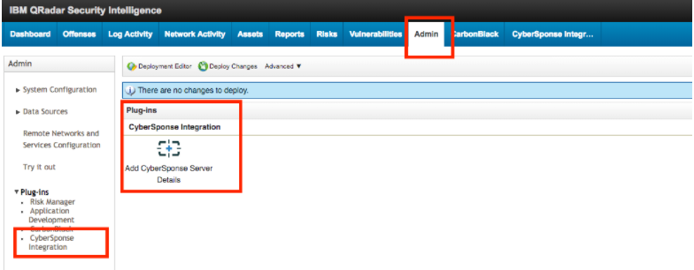

Click the **CyberSponse Integration** icon to open the `Server Configuration` dialog. Enter the details of the CyberSponse server to which you want to forward the offenses and then click **Save**.

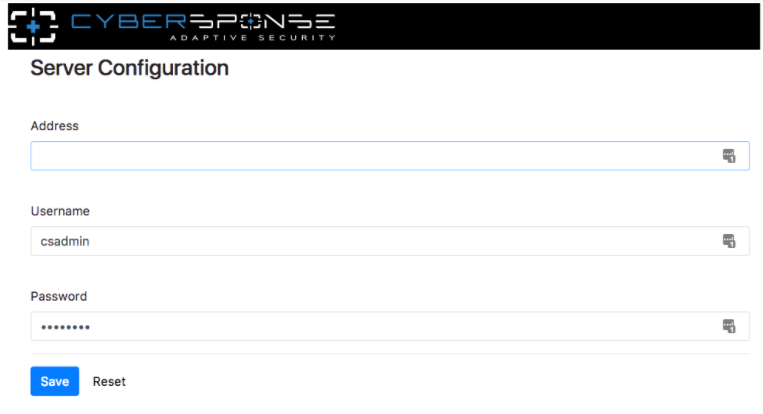

Ensure that the QRadar server has connectivity to the CyOPs™ server and can send requests to the CyOPs™ instance on port 443. Now, you can forward offenses to CyOPs™ by using the **Create CyOPs alert** button in the `Offense Summary Toolbar` as shown in the following image:

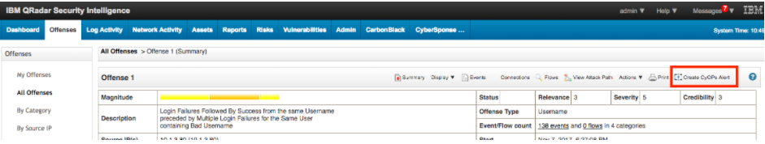

Clicking the the **Create CyOPs alert** button sends a POST trigger to the  `https://<CyOPs>/api/triggers/1/qradar with the payload {“Offense_ID”: <id>}` URL.   
The **API - Push Offense From QRadar** included playbook listens to this API trigger and fetches all the data related to the offense specified in the offence id and creates a CyOPs™ alert. You can verify the integration with the help of this playbook or make a copy of the playbook and update it as per your requirement. If you make a copy, deactivate the included playbook, to avoid two playbooks acting on the same API trigger. 

## Actions supported by the connector

The following automated operations can be included in playbooks and you can also use the annotations to access operations from CyOPs™ release 4.10.0 onwards:

| Function                         | Description                                                  | Annotation and Category                        |
| -------------------------------- | ------------------------------------------------------------ | ---------------------------------------------- |
| Get Offenses                     | Retrieves a list of offenses from the QRadar server based on the filter string that you have specified. | get_offenses   Investigation              |
| Get Events Related to an Offense | Retrieves details of events associated with a QRadar offense, from the QRadar server, based on the QRadar offense ID that you have specified. | get_events   Investigation                |
| Make an Ariel Query to QRadar    | Executes an Ariel query on the QRadar server. QRadar uses the Ariel Query Language (AQL) to search for offenses or events based on query parameters. | run_query   Investigation                 |
| Get Offense Closing Reasons      | Retrieves a list of closing reasons associated with all offenses from the QRadar server. | get_offense_closing_reasons   Remediation |
| Close Offense                    | Closes an offense on the QRadar server based on the offense ID that you have specified. | close_offense   Remediation               |
| Get Source IP Addresses          | Retrieves IP address details associated with a source address IDs from the QRadar server, based on the source address IDs that you have specified | ip_details   Investigation                |
| Get Destinaton IP Addresses      | Retrieves IP address details associated with a destination address IDs from the QRadar server, based on the destination address IDs that you have specified | ip_details   Investigation                |
| Invoke QRadar API                | Invokes a function to Get or Post an API endpoint on the QRadar server. | api_call   Miscellaneous                  |
| Get Offenses Type                | Retrieves a list containing IDs of all the offense types from the QRadar server. | get_offense_type   Investigation          |

### operation: Get Offenses
#### Input parameters

| Parameter     | Description                                                  |
| ------------- | ------------------------------------------------------------ |
| Filter String | Filter string based on which you want to retrieve the list of offenses from QRadar.   For example, `assigned_to="admin"`. |

#### Output

The JSON output contains a list of offenses retrieved from the QRadar server, based on the filter string that you have specified.

Following image displays a sample output:

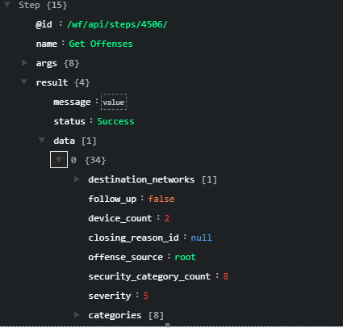

### operation: Get Events Related to an Offense 

#### Input parameters

| Parameter                | Description                                                  |
| ------------------------ | ------------------------------------------------------------ |
| QRadar Offense ID        | Offense ID based on which you want to retrieve events from QRadar. |
| Offense Start Time       | Number of milliseconds since epoch since the offense was started. |
| Offense Last Update Time | Number of milliseconds since epoch since the offense was last modified. |
| Max Events to return     | (Optional) Maximum number of events that this operation should return. |

#### Output

A JSON output contains details of events associated with a QRadar offense, retrieved from the QRadar server, based on the QRadar offense ID that you have specified.

Following image displays a sample output:

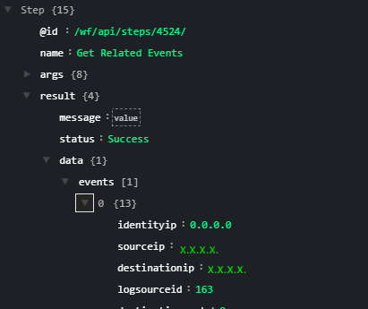

### operation: Make an Ariel Query to QRadar

#### Input parameters

| Parameter           | Description                                               |
| ------------------- | --------------------------------------------------------- |
| Ariel Search String | Ariel query that you want to be run on the QRadar server. |

#### Output

The JSON output contains details of offenses or events depending on the query that you run on the QRadar server. QRadar uses the Ariel Query Language (AQL) to search for offenses or events based on query parameters.

Following image displays a sample output:

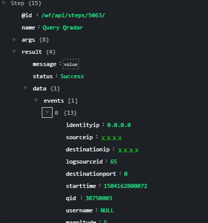

### operation: Get Offense Closing Reasons

#### Input parameters

None

#### Output

The JSON output contains a list of closing reasons associated with all offenses retrieved from the QRadar server.

Following image displays a sample output:

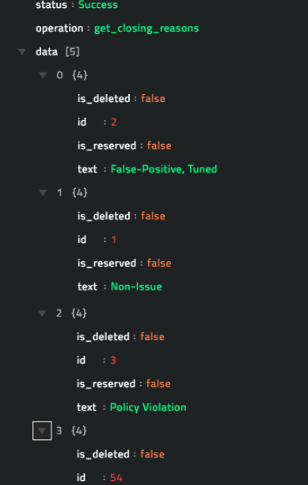

### operation: Close Offense

#### Input parameters

| Parameter                   | Description                                                  |
| --------------------------- | ------------------------------------------------------------ |
| Offense ID                  | ID of the offense that you want to close on the QRadar server. |
| Offense Closing Reason - ID | ID of the offense closing reason using which you want to close the offence on the QRadar server. |

#### Output

The JSON output contains the updated offense details, including the status (should be closed) of the specified offense retrieved from the QRadar server.

Following image displays a sample output:

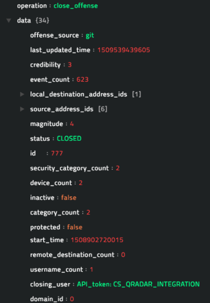

### operation: Get Source IP Addresses

The offense data provided by QRadar contains the IDs of the source addresses. Use this operation to fetch the IP address details for the specified source address IDs.

#### Input parameters

| Parameter          | Description                                                  |
| ------------------ | ------------------------------------------------------------ |
| Source Address Ids | IDs of source addresses based on which you want to retrieve IP address details from the QRadar server. For example, `[3,4,5]`. |

#### Output

The JSON output contains the IP address details associated with the specified source address IDs, retrieved from the QRadar server.

Following image displays a sample output:

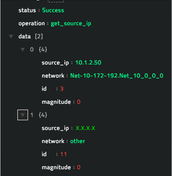

### operation: Get Destination IP Addresses

The offense data provided by QRadar contains the IDs of the destination addresses. Use this operation to fetch the IP address details for the specified destination address IDs.

#### Input parameters

| Parameter               | Description                                                  |
| ----------------------- | ------------------------------------------------------------ |
| Destination Address Ids | IDs of destination addresses based on which you want to retrieve IP address details from the QRadar server. For example, `[3,4,5]`. |

#### Output

The JSON output contains the IP address details associated with the specified destination address IDs, retrieved from the QRadar server.

Following image displays a sample output:

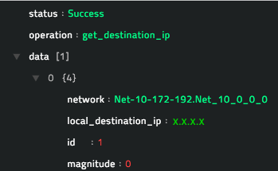

### operation: Invoke QRadar API

If you require to invoke a QRadar API apart from the functions that we provide, you can use this function to directly invoke the QRadar API. Refer to IBM documentation for more information on the QRadar REST APIs: [https://www.ibm.com/support/knowledgecenter/en/SSKMKU/com.ibm.qradar.doc_cloud/t_adm_restapi_using.html](https://www.ibm.com/support/knowledgecenter/en/SSKMKU/com.ibm.qradar.doc_cloud/t_adm_restapi_using.html).

#### Input parameters

| Parameter              | Description                                                  |
| ---------------------- | ------------------------------------------------------------ |
| Request Method         | Select the request method. You can choose between GET or POST. |
| Endpoint               | Specifies the REST endpoint. For example, siem or offenses.  |
| Payload in json format | JSON formatted Payload. For example, `{‘id’: 123}`.          |
| Headers in json format | (Optional) Additional JSON formatted headers.    Following headers are already added by the connector:   `'Accept': 'application/JSON',`   `'Content-Type': 'application/JSON',`    `'SEC': <token>`,   `'Version': <api_version>,` |

#### Output

The JSON output contains the JSON response of the API invoked.

Following image displays a sample output of a REST API being invoked to add a closing reason to an offense:

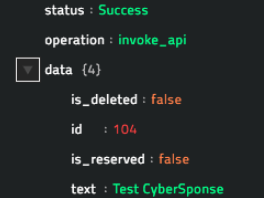

### operation: Get Offenses Type

#### Input parameters

None

#### Output

The JSON output contains a list containing IDs of all the offense types retrieved from the QRadar server. You can use the offense type IDs as a filter criterion in the Get Offenses operation.

Following image displays a sample output:

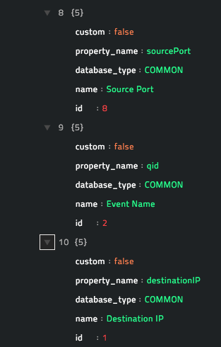

## Prerequisites for running the included Get Offenses playbook for QRadar

This procedure is optional, and should be performed if you are running the **Get Offenses** included playbook. The Get Offenses playbook updates offense details to some custom fields in the `Alerts` module. Therefore, if you want to leverage the Get Offenses playbook, then you can add the custom fields to the `Alerts` module as follows:

1. Add a picklist with the `Name`, `Display Name` and `Description` set as **isQradar**. The List values must be set as **Yes** and **No**.  
   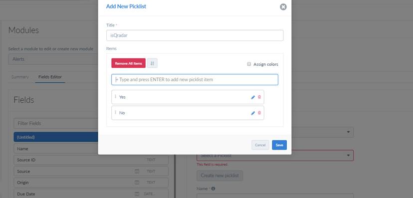  
   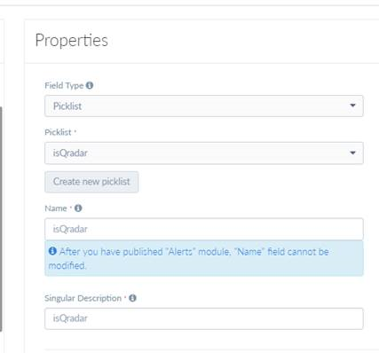  
   **Note**: Ensure that you follow the correct case for for the fields.
2. Add a Text field with the `Name` set as **qradarLtTime** and `Singular Description` set as **QRadar Offense Last Update Time**.
3. Add a Text field with the `Name` set as **qradarStTime** and `Singular Description` set as **QRadar Start Time**.

## Included playbooks

The `Sample - QRadar - 1.2.0`  playbook collection comes bundled with the QRadar connector. This playbook contains steps using which you can perform all supported actions. You can see the bundled playbooks in the **Automation** > **Playbooks** section in CyOPs™ after importing the QRadar connector.

- 1.0 Get Offenses
    - 1.1 Create Alerts From Offenses 
- 2.0 Get Events Related to an Offense
    - 2.1 Create Related Events
- 3.0 Close Offenses
    - 3.1 Close Offense
- 4.0 Run Ariel Query
- 5.0 Invoke QRadar REST API
- 6.0 API - Push Offense From QRadar:  
    Requires installation and configuration of the CyberSponse Application on the QRadar server. See the [Installing the CyberSponse Application on the QRadar Server](#Installing-CyOPs-app-QRadar-Server) section.
- 7.0 Get Offense Type  
    Requires installation and configuration of the CyberSponse Application on the QRadar server. See the [Installing the CyberSponse Application on the QRadar Server](#Installing-CyOPs-app-QRadar-Server) section.

**Note**: If you are planning to use any of the sample playbooks in your environment, ensure that you clone those playbooks and move them to a different collection, since the sample playbook collection gets deleted during connector upgrade and delete.